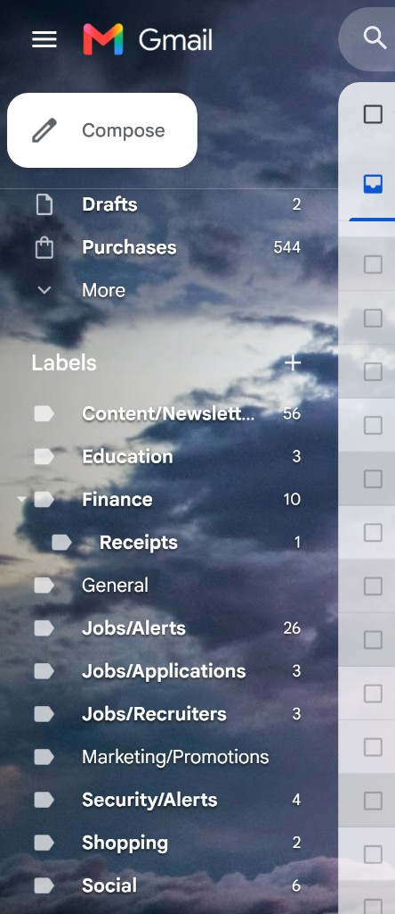
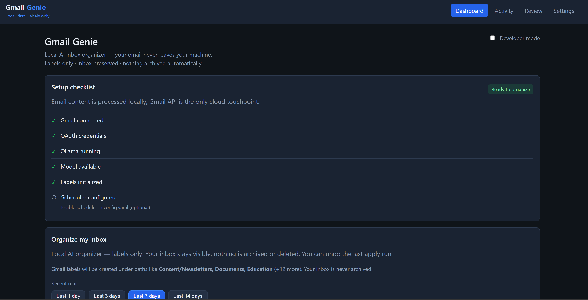
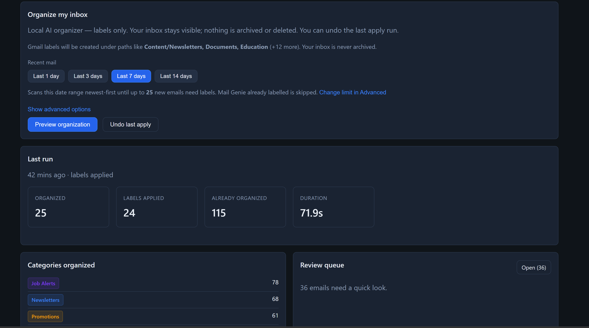
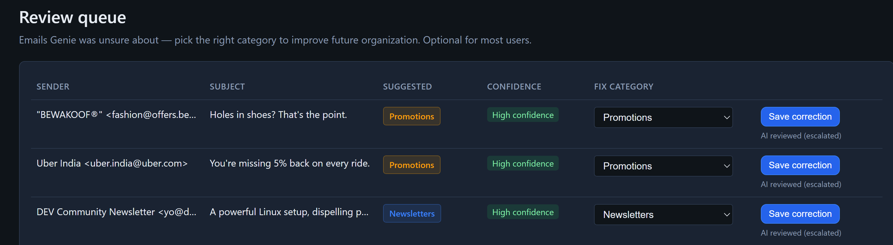
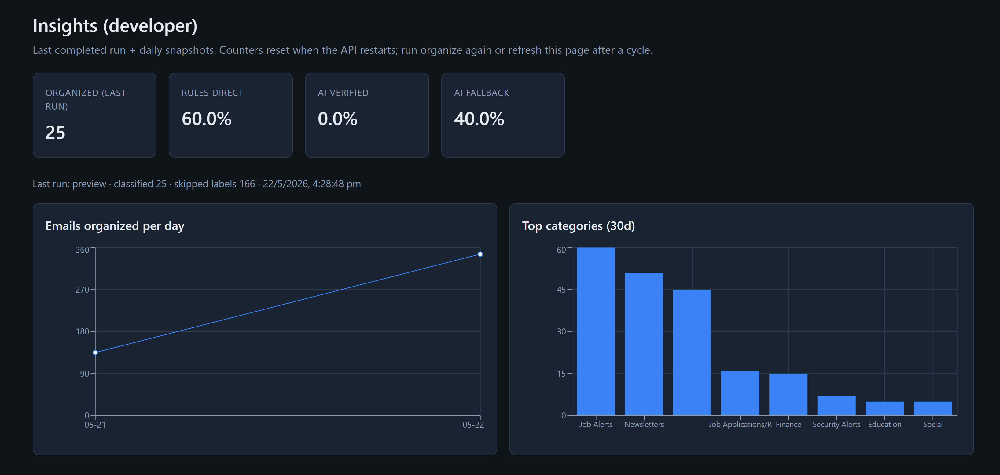
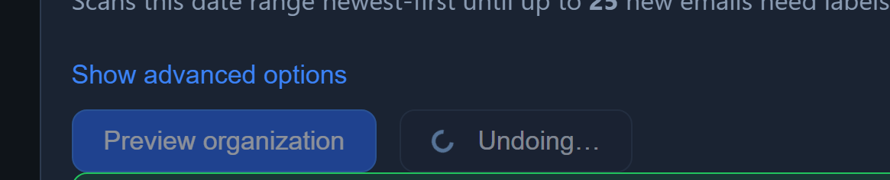
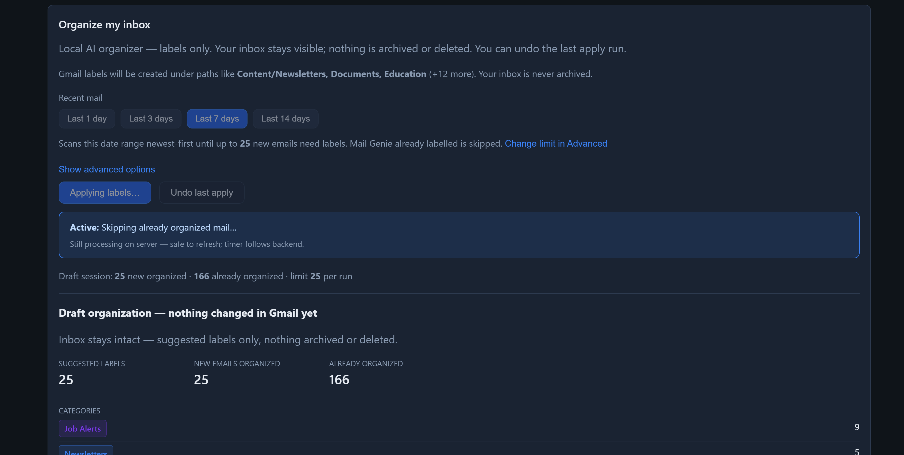
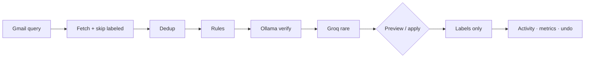

# Gmail Genie

**Local AI inbox organizer — preview-first labeling, inbox preserved, fully reversible.**

[](LICENSE)


Organize recent Gmail with **rules + local AI (Ollama)**. Genie adds **labels only** — no archive, no trash. **Preview** suggestions before apply, then **undo** the last apply if needed.

Runs on your machine. Gmail API is the only cloud touchpoint for mail access.

---

## Screenshots

### Labels in Gmail

Real sidebar after organizing — nested paths from `config.yaml` (e.g. `Jobs/Alerts`, `Finance/Receipts`, `Content/Newsletters`).



### Dashboard



### Preview flow



### Review queue



### Insights (developer mode)



### Undo last apply



### Onboarding checklist



---

## Features

- **Preview-first** — Dry-run table before any Gmail change; draft persists until apply or dismiss
- **Labels only** — Inbox stays visible; `archive: false` in config
- **Undo last run** — Removes Genie labels from the previous apply only
- **Rules + Ollama** — Fast rules; local semantic verify; optional Groq escalation
- **Review queue** — Low-confidence mail + one-click corrections (sender learning)
- **Smart scan** — Date presets or custom query; skips already-labeled mail; SQLite dedup
- **Docker** — API + frontend via `docker compose`
- **Developer mode** — Optional Insights (`/metrics`); hidden by default
- **Scheduler** — Optional background runs; **off by default**

---

## Architecture



**Pipeline:** paginated fetch → skip Genie labels → dedup → classify (rules → Ollama → optional Groq) → apply labels or preview only → activity, review queue, undo store.

**Backend layout:** `backend/api` · `services` · `infrastructure` (gmail, llm) · `storage` · `rules` · `evaluation` · `tests`

---

## Requirements

| Tool | Version |
|------|---------|
| Python | 3.12+ |
| Node.js | 20+ |
| Ollama | [ollama.com](https://ollama.com) |
| Gmail API | OAuth Desktop client → `backend/credentials.json` |
| Docker | Optional |

---

## Quick start

### 1. Clone and install

```powershell
git clone <your-repo-url>
cd gmail-genie
python -m venv venv
.\venv\Scripts\activate
pip install -r requirements.txt
copy .env.example .env
cd frontend && npm install && cd ..
```

macOS/Linux: use `python3`, `source venv/bin/activate`, `cp .env.example .env`.

### 2. Gmail OAuth (one-time)

1. [Google Cloud Console](https://console.cloud.google.com/) → enable **Gmail API**
2. OAuth consent screen → add yourself as test user (if External)
3. **Credentials → OAuth client ID → Desktop app** → download JSON
4. Save as **`backend/credentials.json`**
5. Sign in once:

```powershell
python -c "from backend.infrastructure.gmail.gmail_client import GmailClient; GmailClient()"
```

Creates **`backend/token.json`** (gitignored). Re-run if auth breaks (delete `token.json` first).

### 3. Ollama

```bash
ollama pull mistral:7b-instruct
```

Match `llm.model` in `config.yaml`. Verify: `curl http://127.0.0.1:11434/api/tags`

### 4. Run (Windows)

```powershell
.\start_gmail_genie.bat
```

- UI: http://localhost:5173  
- API: http://127.0.0.1:8000  

**Manual:**

```powershell
.\venv\Scripts\activate
python -m uvicorn backend.api.main:app --host 127.0.0.1 --port 8000 --reload
```

```bash
cd frontend && npm run dev
```

(`backend.main:app` also works — thin re-export.)

### 5. First run

1. Open dashboard → complete **onboarding** checklist  
2. **Preview organization** (e.g. Last 7 days)  
3. Review table → **Apply labels** when ready  
4. **Undo last apply** if needed  

Each run organizes up to **25 new** emails by default (Advanced → max new emails). Already-labeled mail is skipped.

---

## Docker

```powershell
copy .env.production.example .env
# After local OAuth: backend/credentials.json + backend/token.json on host
docker compose up --build
```

| Service | URL |
|---------|-----|
| Frontend | http://localhost:8080 |
| API | http://localhost:8000 |

Ollama on host: `OLLAMA_HOST=host.docker.internal:11434` (see `.env.production.example`).

---

## Configuration

| File | Purpose |
|------|---------|
| `config.yaml` | Categories, labels, LLM, Gmail concurrency, processing caps, scheduler |
| `category_policies.yaml` | Per-category policies (merged at load) |
| `.env` | Secrets, `APP_ENVIRONMENT`, Ollama URL, CORS |

**Defaults worth knowing:**

| Setting | Default |
|---------|---------|
| `processing.target_unprocessed_per_cycle` | `25` |
| `gmail.fetch_concurrency` | `3` (keep ≤ 5 on Windows) |
| `scheduler.enabled` | `false` |

---

## Developer mode

Dashboard → enable **Developer mode** → **Insights** appears in the nav (`/metrics`). Shows transport stats, inference paths, and latency. Stored in browser `localStorage` (`gmail-genie-developer-mode`).

---

## Troubleshooting

<details>
<summary>Common issues</summary>

| Issue | Fix |
|-------|-----|
| OAuth errors | `backend/credentials.json` + test user on consent screen; regenerate `token.json` |
| Ollama down | Start Ollama; `ollama pull mistral:7b-instruct` |
| Cycle 409 | Wait for current run to finish |
| SSL / timeouts (Windows) | Keep `gmail.fetch_concurrency: 3` |
| Insights all zeros | Run a preview after backend restart; refocus Insights tab |
| Preview &lt; inbox count | Cap is **new** actionable mail per run, not full date range |
| Docker + Ollama | `host.docker.internal:11434` on host |

</details>

---

## Limitations

- Single user / local install (no hosted SaaS in this repo)
- Undo = **last apply** only
- Semantic speed depends on hardware
- Gmail API quotas and per-run caps apply

---

## Roadmap

- Multi-account support  
- Optional hosted deployment  
- Richer correction learning + semantic caching  
- Mobile-friendly dashboard  

---

## Contributing

Fork → branch → run tests → PR.

```bash
python -m unittest backend.tests.test_rules_regression backend.tests.test_inbox_processing backend.tests.test_corrections_store -q
```

Do not commit `credentials.json`, `token.json`, or `*.db`.

---

## License

[MIT](LICENSE)

---

<p align="center"><strong>Labels only · inbox preserved · local-first</strong></p>
