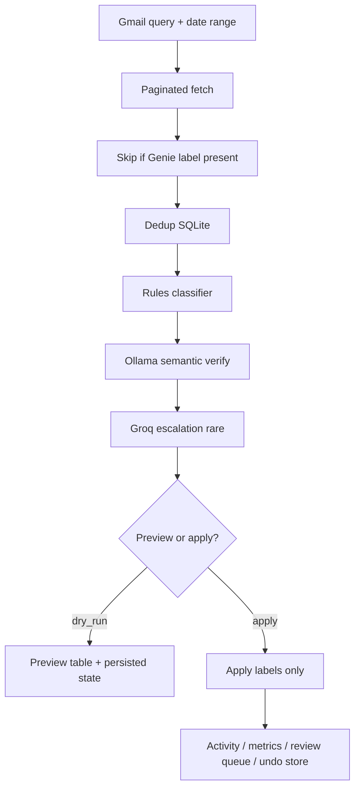

# Gmail Genie

**AI-powered Gmail organization assistant with safe preview-first inbox labeling.**

[](LICENSE)


Gmail Genie helps you **organize recent Gmail** using a hybrid **rules + local AI** classifier. It adds **labels only** — your messages stay in the inbox, nothing is archived or trashed, and you can **preview every suggestion** before applying. When you do apply, you can **undo the last run** to remove Genie-managed labels.

> **Privacy stance:** Classification runs on **your machine** (Ollama). Gmail API is used only to read mail and apply labels you approve. There is no hosted SaaS in this repo — you run everything locally.

---

## Table of contents

1. [Key features](#key-features)  
2. [Product philosophy](#product-philosophy)  
3. [Demo / screenshots](#demo--screenshots)  
4. [Architecture overview](#architecture-overview)  
5. [Project structure](#project-structure)  
6. [Requirements](#requirements)  
7. [Gmail OAuth setup](#gmail-oauth-setup)  
8. [Ollama setup](#ollama-setup)  
9. [Local development setup](#local-development-setup)  
10. [First run workflow](#first-run-workflow)  
11. [Docker setup](#docker-setup)  
12. [Configuration](#configuration)  
13. [Developer mode](#developer-mode)  
14. [Review queue + corrections](#review-queue--corrections)  
15. [Undo system](#undo-system)  
16. [Safety guarantees](#safety-guarantees)  
17. [Troubleshooting](#troubleshooting)  
18. [Known limitations](#known-limitations)  
19. [Roadmap](#roadmap)  
20. [Contributing](#contributing)  
21. [License](#license)  

---

## Key features

| Feature | What you get |
|--------|----------------|
| **Preview-first organization** | Dry-run shows every suggested label in a full table before Gmail changes. Preview persists across navigation until you apply or dismiss. |
| **Inbox-safe labels only** | Genie never archives or trashes mail. Inbox visibility is preserved (`archive: false` everywhere in config). |
| **Rules + AI hybrid** | Fast deterministic rules classify most mail; Ollama verifies borderline cases; optional Groq escalation for rare low-confidence paths. |
| **Human review queue** | Ambiguous or low-margin emails surface for manual review and one-click corrections. |
| **Undo last run** | Removes only labels Genie added in the **previous apply** — messages themselves are untouched. |
| **Semantic fallback (Ollama)** | Local model verification without sending full inboxes to a cloud LLM (Groq is optional and rare). |
| **Smart Gmail scanning** | Paginated fetch (newest first), skips mail that already has Genie labels, deduplicates via SQLite. |
| **Dashboard + metrics** | Health, last cycle status, activity log, daily charts; optional engineering metrics in developer mode. |
| **Docker support** | `docker compose` for API + static frontend; OAuth files mounted from host. |
| **Developer mode** | Optional transport, latency, and inference-path diagnostics (hidden by default). |
| **Scheduler** | Optional automatic cycles — **disabled by default** for new installs. |

---

## Product philosophy

Gmail Genie is built around a few non-negotiable ideas:

- **Safety-first** — No surprise bulk archive/trash. Labels are visible, reversible actions.
- **Inbox preservation** — Organized mail stays in the inbox unless *you* change that in Gmail separately.
- **Preview before apply** — First-time flow encourages dry-run so you see categories before anything hits Gmail.
- **Human-in-the-loop** — Review queue and corrections improve trust; sender learning boosts future rule scores.
- **Incremental organization** — Each run targets a bounded number of *new* actionable emails (not your entire mailbox at once).
- **Local-first privacy** — Ollama runs on your PC; secrets stay in `.env` and gitignored OAuth files.

---

## Demo / screenshots

Add real captures under [`docs/screenshots/`](docs/screenshots/README.md) (placeholders below until you add images).

| Screenshot | File | Description |
|------------|------|-------------|
| Dashboard | `docs/screenshots/dashboard.png` | Main dashboard — organize panel, health, last run |
| Preview flow | `docs/screenshots/preview.png` | Draft organization table + **Apply labels** |
| Review queue | `docs/screenshots/review-queue.png` | Items needing human review |
| Metrics | `docs/screenshots/metrics.png` | Daily charts + session stats (developer mode / Insights) |
| Undo flow | `docs/screenshots/undo.png` | Undo last apply confirmation |
| Onboarding | `docs/screenshots/onboarding.png` | Setup checklist |

```markdown


```

---

## Architecture overview

### End-to-end pipeline



**ASCII view (same flow):**

```
Gmail Query
    → Paginated Fetch (newest first)
    → Label Skip (already organized)
    → Dedup (processed store)
    → Rules Engine
    → Semantic Verify (Ollama)
    → Groq Escalation (optional, rare)
    → Labels Applied (or preview only)
    → Activity / Metrics / Review Queue / Undo record
```

### Design choices (short)

| Topic | Behavior |
|-------|----------|
| **Rules-first** | Most emails never need an LLM call; rules are fast and explainable. |
| **Semantic fallback** | Ollama re-checks medium-confidence rule results (`config.yaml` → `llm.*` thresholds). |
| **Why inbox is never archived** | Product guarantee + `category_policies.yaml` / `actions.*.archive: false`. |
| **SQLite stores** | Corrections, activity, daily metrics, cycle undo, dedup cache — all local files under `backend/data/` and project `data/`. |
| **Scheduler** | Background APScheduler job; off by default; respects `dry_run` when enabled. |
| **Dashboard polling** | UI polls cycle status and health so long runs show progress without blocking the browser. |

---

## Project structure

```
Gmail Genie/
├── backend/
│   ├── api/                 # FastAPI app (main.py), schemas, API errors
│   ├── services/            # Cycles, classifier, inbox processing, undo, dashboard
│   ├── infrastructure/
│   │   ├── gmail/           # Gmail client, transport, label helpers
│   │   ├── llm/             # Ollama/Groq providers, rule trust
│   │   ├── logging/         # Log setup
│   │   └── health/          # Health checks, startup validation
│   ├── storage/             # SQLite stores, session metrics
│   ├── rules/               # Rule engine + scoring + sender learning
│   ├── evaluation/          # Offline classifier evaluation scripts
│   ├── tests/               # Unit / regression tests
│   ├── data/                # Runtime DBs + last_cycle.json (gitignored)
│   ├── logs/                # Action audit log (gitignored)
│   ├── credentials.json     # OAuth client secret (you add; gitignored)
│   └── token.json           # OAuth token (generated; gitignored)
├── frontend/                # React + Vite dashboard
├── docs/screenshots/        # README assets
├── config.yaml              # Main app config
├── category_policies.yaml   # Per-category policy merge
├── docker-compose.yml
├── scripts/                 # start_backend.bat, start_frontend.bat, start_all.bat
└── start_gmail_genie.bat    # Recommended Windows launcher
```

---

## Requirements

Install these **before** you start. Versions below match what the repo is tested with.

| Requirement | Version / notes |
|-------------|-----------------|
| **Python** | **3.12+** (3.12 recommended; matches `backend/Dockerfile`) |
| **Node.js** | **20+** (LTS; Vite 8 / React 19) |
| **npm** | Comes with Node (used in `frontend/`) |
| **Ollama** | Latest from [ollama.com](https://ollama.com) — local LLM runtime |
| **Gmail API** | Google Cloud project + OAuth **Desktop** client → `backend/credentials.json` |
| **Groq API key** | Optional — only for rare escalation (`GROQ_API_KEY` in `.env`) |
| **Docker Desktop** | Optional — for containerized API + frontend |
| **Git** | To clone the repository |

**OS notes**

- **Windows** — Primary dev path; use `start_gmail_genie.bat`. Keep Gmail `fetch_concurrency` at **3** (SSL stability with httplib2).
- **macOS / Linux** — Same steps with `python3`, `source venv/bin/activate`, and shell equivalents below.

---

## Gmail OAuth setup

Gmail Genie uses a **Desktop OAuth client** so you sign in once in the browser; the app stores a refresh token locally.

### Step 1 — Google Cloud project

1. Open [Google Cloud Console](https://console.cloud.google.com/).
2. Create a project (e.g. `Gmail Genie Local`).
3. Select that project in the top bar.

### Step 2 — Enable Gmail API

1. **APIs & Services → Library**
2. Search **Gmail API** → **Enable**

### Step 3 — OAuth consent screen

1. **APIs & Services → OAuth consent screen**
2. User type: **External** (fine for personal use) or **Internal** (Workspace only)
3. Fill app name, support email, developer contact
4. Scopes: for first setup you can add later during consent; Genie uses `gmail.modify`
5. **Test users** — Add your Gmail address while app is in *Testing* mode

### Step 4 — Create OAuth client (Desktop)

1. **APIs & Services → Credentials → Create credentials → OAuth client ID**
2. Application type: **Desktop app**
3. Download JSON

### Step 5 — Place credentials on disk

Save the downloaded file **exactly here**:

```
<project-root>/backend/credentials.json
```

Example (Windows):

```
D:\Gmail Genie\backend\credentials.json
```

> **Never commit** `credentials.json` or `token.json` — they are in `.gitignore`.

### Step 6 — First sign-in (generates `token.json`)

From project root with venv activated:

**Windows (PowerShell):**

```powershell
cd "D:\Gmail Genie"   # your clone path
.\venv\Scripts\activate
python -c "from backend.infrastructure.gmail.gmail_client import GmailClient; GmailClient()"
```

**macOS / Linux:**

```bash
cd ~/gmail-genie
source venv/bin/activate
python -c "from backend.infrastructure.gmail.gmail_client import GmailClient; GmailClient()"
```

1. Browser opens → pick your Google account  
2. Grant access  
3. File created: **`backend/token.json`** (local only, gitignored)

### Step 7 — Verify in the app

After starting the stack, open the dashboard — the **onboarding checklist** should show Gmail OAuth as complete when both files exist and health checks pass.

| File | Location | Committed? |
|------|----------|------------|
| `credentials.json` | `backend/credentials.json` | No |
| `token.json` | `backend/token.json` | No |

**If token expires or auth breaks:** delete `backend/token.json` and repeat Step 6.

---

## Ollama setup

Ollama provides **local** semantic verification (no cloud required for normal operation).

### 1 — Install Ollama

- **Windows / macOS:** Download installer from [https://ollama.com](https://ollama.com) and run it.  
- **Linux:** `curl -fsSL https://ollama.com/install.sh | sh`

Ensure the Ollama service is running (system tray on Windows, `ollama serve` on Linux if needed).

### 2 — Pull the model

Default in `config.yaml` is **`mistral:7b-instruct`**. Pull it (or the model you configure):

```bash
ollama pull mistral:7b-instruct
```

Alternative tag some users use:

```bash
ollama pull mistral
```

> Use the **same name** in `config.yaml` → `llm.model`.

### 3 — Configure (optional overrides)

| Source | Setting |
|--------|---------|
| `config.yaml` | `llm.model`, `llm.provider`, thresholds |
| `.env` | `OLLAMA_BASE_URL`, `OLLAMA_HOST` (default `http://127.0.0.1:11434`) |

### 4 — Verify Ollama is healthy

```bash
curl http://127.0.0.1:11434/api/tags
```

You should see JSON listing installed models.

In Gmail Genie, the dashboard **health** section and onboarding checklist also report Ollama availability. If Ollama is down, the app can still run **rules-only** with degraded accuracy for borderline mail.

---

## Local development setup

### 1 — Clone the repository

```bash
git clone https://github.com/YOUR_ORG/gmail-genie.git
cd gmail-genie
```

Replace the URL with your fork or local path.

### 2 — Python virtual environment

**Windows (PowerShell):**

```powershell
python -m venv venv
.\venv\Scripts\activate
pip install -r requirements.txt
```

**macOS / Linux:**

```bash
python3 -m venv venv
source venv/bin/activate
pip install -r requirements.txt
```

### 3 — Environment file

**Windows:**

```powershell
copy .env.example .env
```

**macOS / Linux:**

```bash
cp .env.example .env
```

Edit `.env` if you use Groq or non-default Ollama URL.

### 4 — Frontend dependencies

```bash
cd frontend
npm install
cd ..
```

Optional: `copy frontend\.env.example frontend\.env` — default API URL `http://127.0.0.1:8000` is usually fine.

### 5 — Gmail OAuth + Ollama

Complete [Gmail OAuth setup](#gmail-oauth-setup) and [Ollama setup](#ollama-setup) before first organize run.

### 6 — Start the application

#### Recommended (Windows): one launcher

```powershell
.\start_gmail_genie.bat
```

This checks Python, `node_modules`, Ollama, OAuth files, then opens:

- Backend: http://127.0.0.1:8000  
- Frontend: http://localhost:5173  
- Browser to the dashboard  

#### Manual: two terminals

**Terminal 1 — API (project root):**

```powershell
.\venv\Scripts\activate
python -m uvicorn backend.api.main:app --host 127.0.0.1 --port 8000 --reload
```

**Terminal 2 — UI:**

```bash
cd frontend
npm run dev
```

Or use helper scripts:

```powershell
scripts\start_all.bat
```

| Service | URL |
|---------|-----|
| Frontend | http://localhost:5173 |
| Backend API | http://127.0.0.1:8000 |
| OpenAPI docs | http://127.0.0.1:8000/docs |

**Backward-compatible entrypoint:** `backend.main:app` still re-exports the same app.

### 7 — Run tests (optional)

```bash
python -m unittest backend.tests.test_rules_regression backend.tests.test_inbox_processing backend.tests.test_corrections_store backend.tests.test_dashboard_ops -q
```

---

## First run workflow

Follow this sequence the first time you use Genie — it matches how the UI is designed to be safe.

### 1 — Open the dashboard

Go to http://localhost:5173 (or http://localhost:8080 in Docker).

### 2 — Complete onboarding

The checklist verifies:

- `backend/credentials.json` and `backend/token.json`
- Ollama reachable
- Config present
- Optional: scheduler status

Fix any red items before organizing.

### 3 — Preview (dry-run) — e.g. “Last 7 days”

On the dashboard **Organize** panel:

1. Choose a date preset (**1 / 3 / 7 / 14 days**) or advanced Gmail query  
2. Leave **Preview** enabled (default for new users)  
3. Run organize  

You get a **full table** of emails with suggested categories — **no Gmail labels applied yet**.

> **Tip:** Under the presets, the UI explains that each run organizes up to **N new emails** (see Advanced → max new emails), not every message in the date range.

### 4 — Review suggestions

- Scan categories in the preview table  
- Open **Review queue** for ambiguous items  
- Use **Developer mode** only if you need transport/latency detail  

### 5 — Apply labels

When satisfied, click **Apply labels** on the preview bar. Genie creates/applies Gmail labels per `config.yaml` → `labels`.

- Messages **remain in the inbox**  
- Only labels change  

### 6 — Undo if needed

**Undo last apply** removes Genie-managed labels from the **previous apply cycle** only. It does not delete messages or remove your own manual labels.

### Preview persistence

- Dry-run results are stored server-side (`backend/data/last_cycle.json`) and exposed via `GET /pending-preview`  
- Navigating away and returning can restore the draft until you apply or dismiss  

---

## Docker setup

Docker runs the **FastAPI backend** and a **built static frontend** (nginx) without installing Node on the host for production-like trials.

### What Docker does

| Service | Port | Role |
|---------|------|------|
| `backend` | **8000** | API + classifier + Gmail client |
| `frontend` | **8080** | Pre-built React UI (`VITE_API_BASE` → backend) |

Volumes persist `backend/data`, `backend/logs`, project `data/`, and mount config files read-only.

### Why use it

- Consistent Python 3.12 runtime  
- No local `npm run dev` required for the UI  
- Good for a dedicated machine or homelab  

### Prerequisites

1. Complete **OAuth on the host first** (Steps in [Gmail OAuth](#gmail-oauth-setup)) so you have `backend/credentials.json` and `backend/token.json`.  
2. Install **Docker Desktop** (Windows/Mac) or Docker Engine (Linux).  
3. Ollama usually runs on the **host** — compose sets `OLLAMA_HOST=host.docker.internal:11434`.

### Commands

**Windows:**

```powershell
copy .env.production.example .env
# Edit .env if needed (Groq, CORS)
docker compose up --build
```

**macOS / Linux:**

```bash
cp .env.production.example .env
docker compose up --build
```

Open:

- UI: http://localhost:8080  
- API: http://localhost:8000  

Ensure `docker-compose.yml` volume lines for OAuth files are uncommented / present:

```yaml
- ./backend/credentials.json:/app/backend/credentials.json:ro
- ./backend/token.json:/app/backend/token.json
```

### Ollama in Docker

The container expects Ollama on the host:

- `OLLAMA_HOST=host.docker.internal:11434` (Docker Desktop)  
- Pull the same model on the host: `ollama pull mistral:7b-instruct`  

If health shows Ollama degraded, rules still run; semantic verify may be skipped.

---

## Configuration

### `config.yaml` (main)

| Section | Purpose |
|---------|---------|
| `categories` / `labels` | UI categories and Gmail label paths |
| `llm` | Ollama model, confidence thresholds, Groq escalation |
| `gmail` | HTTP timeout, retries, **fetch_concurrency** (default **3**) |
| `processing` | Per-cycle caps, pagination, dedup |
| `scheduler` | Automatic runs (**`enabled: false`** by default) |
| `safety` / `actions` | Per-category label/archive flags (archive stays **false**) |
| `logging` | Action audit log path |

**Important processing keys:**

| Key | Default | Meaning |
|-----|---------|---------|
| `processing.target_unprocessed_per_cycle` | `25` | Max **new** emails organized per run |
| `processing.max_scan_pages` | `10` | Pagination safety cap |
| `gmail.fetch_concurrency` | `3` | Parallel Gmail fetches (do not exceed **5** on Windows) |

### `category_policies.yaml`

Merged at startup for per-category behavior (e.g. never trash certain categories). Archive remains off for inbox safety.

### `.env` (secrets & environment)

| Variable | Typical use |
|----------|-------------|
| `APP_ENVIRONMENT` | `development` or `production` |
| `GROQ_API_KEY` | Optional escalation |
| `OLLAMA_BASE_URL` / `OLLAMA_HOST` | Ollama location |
| `FRONTEND_ORIGIN` | CORS allowlist |
| `VITE_API_BASE` | Frontend → API URL (build time) |

Copy templates:

- Local: `.env.example`  
- Docker: `.env.production.example`  

### Scheduler

```yaml
scheduler:
  enabled: false
  interval_minutes: 15
  dry_run: true
```

> **Warning:** Enabling the scheduler without understanding `dry_run` can auto-apply labels on a timer. Leave disabled until you intentionally want automation.

### Production mode

Set `APP_ENVIRONMENT=production` (and use `.env.production.example` for Docker). Stricter logging and startup validation; OpenAPI may be restricted in production.

---

## Developer mode

Developer mode exposes **engineering diagnostics** that normal users do not need.

### How to enable

On the **Dashboard**, toggle **Developer mode**. The preference is stored in browser `localStorage` under key `gmail-genie-developer-mode`.

### What appears

- Gmail **transport** retries, SSL error counts, fetch concurrency hints  
- **Inference path** rates (rules vs semantic vs Groq)  
- **Latency** breakdown for cycles  
- Extra columns in Activity / Review tables  
- **Insights** nav link → `/metrics` (hidden when developer mode is off)  

### When to use it

Debugging slow runs, SSL issues on Windows, or verifying Ollama/Groq paths — not required for everyday organization.

---

## Review queue + corrections

Some emails are **ambiguous** (close scores between categories, low confidence, or borderline semantic results). These appear in the **Review queue** with plain-language reasons.

### Human corrections

When you correct a classification:

1. Feedback is stored in **SQLite** (`corrections_store`)  
2. **Sender learning** can boost future rule scores for that sender after enough consistent corrections  
3. Quality improves without retraining a cloud model  

### Why this matters

Rules alone are fast but brittle on edge cases; corrections teach the system your preferences **locally** and safely.

---

## Undo system

| Aspect | Behavior |
|--------|----------|
| **Scope** | Last **apply** cycle only (not preview, not older runs) |
| **What changes** | Removes **Genie-managed labels** recorded for that cycle |
| **What is preserved** | Message bodies, inbox placement, your manual labels |
| **API** | `POST /undo-last-cycle` (blocked while a cycle is running) |

Preview (dry-run) does not create undo records — nothing was applied.

---

## Safety guarantees

Gmail Genie is explicit about what it will and will not do:

| Guarantee | Detail |
|-----------|--------|
| **No archiving** | `archive: false` in category actions |
| **No trashing** | `max_trash_per_cycle: 0`; trash categories disabled |
| **Inbox preserved** | Labels only; inbox not cleared by Genie |
| **Preview before apply** | Dry-run default; persisted preview until apply/dismiss |
| **Local-first storage** | SQLite and logs on disk; OAuth tokens gitignored |
| **Reversible apply** | Undo last apply removes Genie labels only |
| **Bounded batch size** | Caps per run to avoid accidental mass mutation |

> Genie cannot recover mail you delete manually in Gmail. It only controls labels it applied.

---

## Troubleshooting

### Gmail OAuth failures

| Symptom | Fix |
|---------|-----|
| `credentials.json` missing | Download Desktop OAuth JSON → `backend/credentials.json` |
| Browser loop / access blocked | Add your email as OAuth **test user** on consent screen |
| `invalid_grant` / 401 | Delete `backend/token.json`, re-run OAuth script |
| Docker cannot auth | Mount `credentials.json` and `token.json` volumes |

### Token expiration

Delete `backend/token.json` and run:

```bash
python -c "from backend.infrastructure.gmail.gmail_client import GmailClient; GmailClient()"
```

### Ollama not running

| Symptom | Fix |
|---------|-----|
| Health shows Ollama degraded | Start Ollama app / `ollama serve` |
| Model not found | `ollama pull mistral:7b-instruct` (match `config.yaml`) |
| Docker cannot reach Ollama | Use `host.docker.internal:11434` on host with model pulled |

### Slow semantic classification

- Reduce batch size in UI Advanced settings  
- Lower `llm.semantic_max_concurrency` if CPU-bound  
- Use a smaller Ollama model  
- Strong rules + high `rule_trust_short_circuit` mean fewer LLM calls over time  

### Docker issues

- Rebuild: `docker compose up --build`  
- OAuth: ensure token exists on host before compose  
- CORS: `FRONTEND_ORIGIN` must include `http://localhost:8080`  
- API from UI: `VITE_API_BASE` must match published backend port  

### SSL / timeouts on Windows

```
WRONG_VERSION_NUMBER / bad record MAC / read timeout
```

- Set `gmail.fetch_concurrency: 3` in `config.yaml` (default)  
- Do not raise above **5**  
- Retry the cycle after network blips  

### Scheduler confusion

- Default **`scheduler.enabled: false`** — no background runs until you enable it  
- When enabled, check `dry_run` and `interval_minutes`  

### Review queue confusion

- Items are **low confidence or ambiguous**, not necessarily wrong  
- Correcting a row improves sender learning  

### Label skip behavior

- Mail that **already has a Genie label** is skipped (shown as skipped in metrics)  
- This is why “44 scanned, 24 organized” is normal — not all scanned mail is “new”  

### Preview shows fewer emails than inbox

Expected. Each run stops after **`target_unprocessed_per_cycle`** new actionable emails (default **25**), even if the date range is larger. Increase in Advanced if you understand the load.

### Cycle busy (HTTP 409)

Wait for the current organize run to finish; only one cycle at a time.

### Preview disappeared

- You may have dismissed the draft  
- Re-run preview, or check `GET /pending-preview` via API  

---

## Known limitations

| Limitation | Notes |
|------------|-------|
| **Single-user** | One OAuth token / mailbox per install |
| **Local-first** | No built-in hosted multi-tenant SaaS |
| **Semantic latency** | Ollama speed depends on hardware |
| **Undo** | **Last apply cycle only** |
| **Gmail API quotas** | Heavy date ranges + pagination can hit limits or caps |
| **Windows transport** | Parallel Gmail fetch is intentionally conservative |
| **General category** | May not apply a label (`apply_label: false` in config) |

---

## Roadmap

Community-facing direction (not committed dates):

- Multi-account support  
- Hosted / managed deployment option  
- Smarter feedback learning from corrections  
- Better semantic result caching  
- Mobile-friendly dashboard UX  
- Richer analytics and export of preview sessions  

---

## Contributing

Contributions are welcome.

1. Fork the repository  
2. Create a branch (`git checkout -b feature/my-change`)  
3. Keep changes focused — Gmail Genie favors **small, safe diffs**  
4. Run tests: `python -m unittest discover -s backend/tests -q`  
5. Open a pull request with a clear description and screenshots if UI changes  

Please **do not** commit secrets, `token.json`, `credentials.json`, or `*.db` files.

---

## License

[MIT License](LICENSE) — Copyright (c) Gmail Genie contributors.

---

<p align="center">
  <strong>Local AI inbox organizer — your email stays on your machine. Labels-only. Fully reversible.</strong>
</p>
